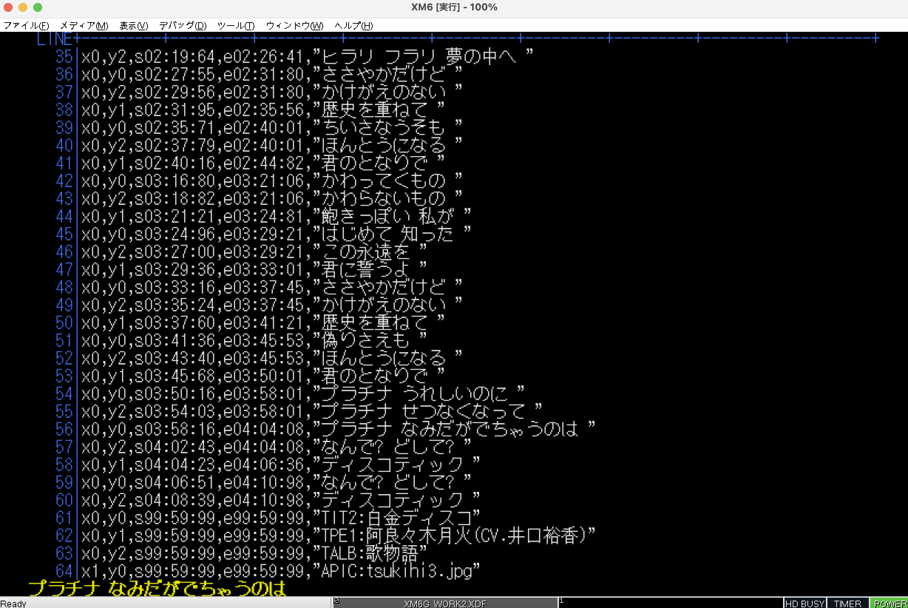

# TXVIEW.X

A simple text viewer for X680x0/Human68k

シンプルなテキストビュワーです。

 - less/vim風キーバインド
 - 行番号
 - スムーススクロール
 - 前方後方検索

既存の高速ビュワーやファイラー内蔵のビュワーでスムーススクロールを行うと、ほぼ確実に PCM8PP.X + S44BGP.X の演奏が停止してしまいます。

[S44BGP.X](https://github.com/tantanGH/s44bgp)

これは、低クロック機でも高速で滑らかなテキストスクロールを実現するために、ステータスレジスタ(SR)で他の割り込みをガッチリブロックしてHSYNCを気にしながらCRTCを直接操作してラスタコピーを行う...といった攻めた実装による所が大きいのかなと思います。

しかしながら自分の環境(060turbo or エミュレータ)では高速性よりも PCM8PP.X + S44BGP.X を停止されてしまうことのデメリットの方が大きいので、あまりカツカツに無理せず、割り込みも使わずせいぜいVSYNCを見ながらIOCSコールでラスタコピーする程度のものを自作しました。

当方の環境(実機・エミュレータ両方)においてはスムーススクロールを行っても PCM8PP.X + S44BGP.X には影響ありません。
また、最下段はS44BGP.Xの歌詞表示のために空けてありますw

---

### インストール方法

TXVIWxxx.ZIP をダウンロードして展開し、TXVIEW.X をパスの通ったディレクトリに置きます。

開発・動作確認は X68030 (25MHz) と 060turbo (50MHz) で行っています。低クロック機では恐らくもたつきなどが出ると思います。

---

### 使用方法

    txview [オプション] <テキストファイル名>

      -g    ... 512x512x65536グラフィック画面を表示して起動します
      -s    ... スクロール速度を半分にします
      -h    ... ヘルプメッセージを表示します

060loadhigh.x を使ったハイメモリ上での実行に対応しています。

---

### キーバインド

- `ESC` `q`

TXVIEW.Xを終了します。
 

- `LEFT` `RIGHT` (カーソル左右)

低速でスムーススクロールします。
 

- `UP` `DOWN` (カーソル上下)

通常速度でスムーススクロールします。
 

- `ROLLUP` `ROLLDOWN`

ページ送り・戻しをします。
 

- `HOME`

先頭に戻ります。
 

- `UNDO`

最後端に移動します。
 

- `k` `j`

`UP` `DOWN` と同じです。(less/vimキーバインド)
 

- `<` `>`

`HOME` `UNDO` と同じです。(less/vimキーバインド)
 

- `SPACE` `b`

`ROLLUP` `ROLLDOWN` と同じです。(less/vimキーバインド)
 

- `/` `s` `f`

前方検索を行います。画面右上に検索ワード入力用プロンプトが出ます。
 

- `?` `S` `F`

後方検索を行います。画面右上に検索ワード入力用プロンプトが出ます。
 

---

### Special Thanks

* xdev68k thanks to ファミべのよっしんさん
* HAS060.X on run68mac thanks to YuNKさん / M.Kamadaさん / GOROmanさん
* HLK301.X on run68mac thanks to SALTさん / GOROmanさん

---

### History

* 0.1.0 (2023/03/27) ... 初版